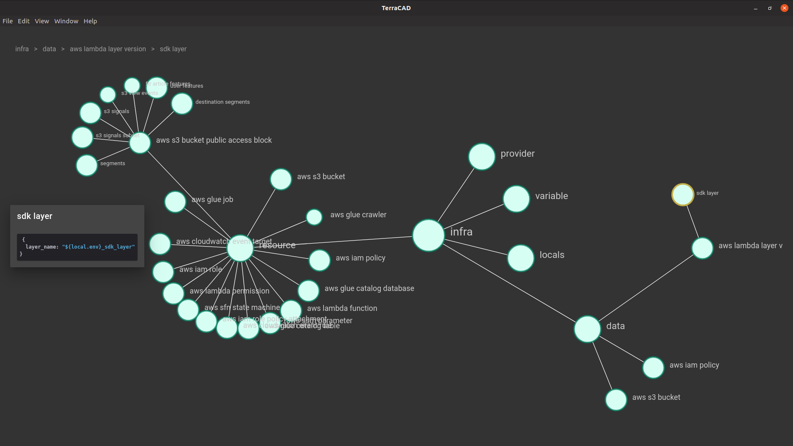

# Overview

TerraCAD visualized terraform projects as a network graph with collapsable nodes.

_Sample of opened network_

## Basic usage

1. Follow the instructions in [Development](./guides/Development) to set up your development environment.
2. Once you have a terraform project loaded you should be able to zoom and pan the graph by clicking and dragging any empty space.
3. You can reposition nodes by dragging and dropping.
4. You can expand and collapse nodes by clicking on them. To collapse a node it must first have been selected with a click.

## Future plans

Future plans include the implementation of:

- [ ] Adding and removing items
- [ ] Editing item properties
- [ ] Saving current state as terraform compatible files (either .tf or .json)
